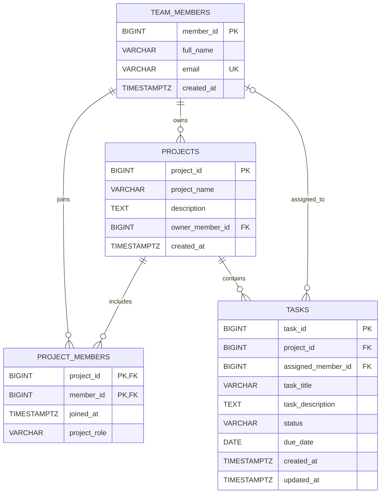

```mermaid
erDiagram
    TEAM_MEMBERS ||--o{ PROJECTS : owns
    TEAM_MEMBERS ||--o{ PROJECT_MEMBERS : joins
    PROJECTS ||--o{ PROJECT_MEMBERS : includes
    PROJECTS ||--o{ TASKS : contains
    TEAM_MEMBERS o|--o{ TASKS : assigned_to

    TEAM_MEMBERS {
        BIGINT member_id PK
        VARCHAR full_name
        VARCHAR email UK
        TIMESTAMPTZ created_at
    }

    PROJECTS {
        BIGINT project_id PK
        VARCHAR project_name
        TEXT description
        BIGINT owner_member_id FK
        TIMESTAMPTZ created_at
    }

    PROJECT_MEMBERS {
        BIGINT project_id PK, FK
        BIGINT member_id PK, FK
        TIMESTAMPTZ joined_at
        VARCHAR project_role
    }

    TASKS {
        BIGINT task_id PK
        BIGINT project_id FK
        BIGINT assigned_member_id FK
        VARCHAR task_title
        TEXT task_description
        VARCHAR status
        DATE due_date
        TIMESTAMPTZ created_at
        TIMESTAMPTZ updated_at
    }
```
